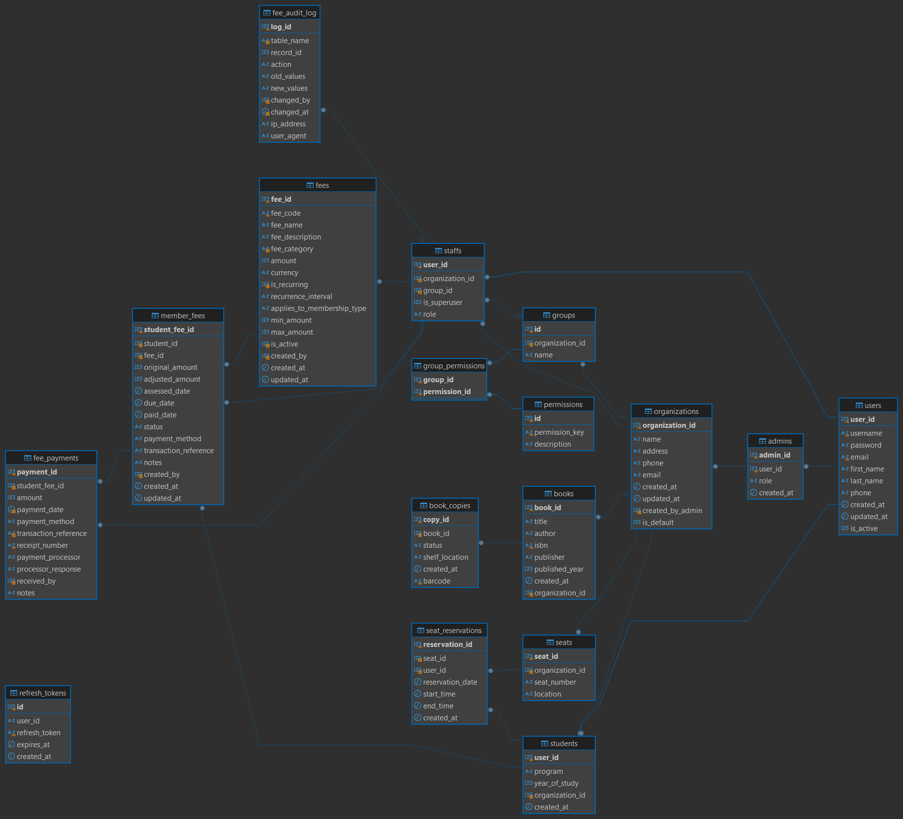

# Library Management ERP - Backend

A RESTful API backend for managing library operations, including user accounts, book inventory, loans, and administrative functions. Dynamics Role Creation and management for different user types (Admin, Librarian, Staff, Member. You can create these roles and Assign permissions) with JWT authentication and Google OAuth integration.

Note: I am Currently working on this project, so it is not fully completed yet, but you can use it as a reference for your own projects.

## Frontend Repository

The frontend for this project is available at: [library_system_v2_frontend](https://github.com/rahulkbharti/library_system_v2_frontend)

### Database Design:

1. An Admin Can Create multiple organizations and create multiple roles for each organization.
2. Admin have all permissions to his/her each organization.
3. Admin can create multiple Staff Accounts and assign them to different roles. Also Can Create multiple Members.
4. Staff can create multiple members as per their role permissions.
5. Staff can manage books and loans as per their role permissions.



## Features

- **User Management**

  - Admin-controlled account creation for staff & members
  - Role-based access (Admin, Librarian, Staff, Member)
  - JWT authentication and Google OAuth support.

- **Core Functions**

  - Book catalog management (CRUD operations)
  - Loan/return tracking with overdue calculations
  - Reservation system
  - Fine management

- **Admin Tools**
  - Bulk import of users/books
  - Audit logs for all transactions
  - Reporting dashboard

## Tech Stack

- **Framework**: Node.js (Express)
- **Database**: MySQL
- **Authentication**: JWT and Google OAuth
- **Testing**: Jest, Postman

## Installation

### Prerequisites

- Node.js 22+
- MySQL 8+
- Git

### Steps

1. Clone the repo:

   ```bash
   git clone https://github.com/rahulkbharti/library_system_v2_backend.git
   cd library_system_v2_backend
   ```

2. Install dependencies:

   ```bash
   npm install
   ```

3. Configure environment:

   ```bash
   cp  .env.development # for development
   # Edit .env.development with your database credentials
   ```

4. Start the server:
   ```bash
    npm run dev  # for development
    npm start
   ```

## Account Types

1. **Admin**

   - Full system control
   - Manages all user accounts
   - All permissions for his/her each organization.

2. **Staff**

   - Basic book management
   - View member profiles
   - Assigned specific roles with limited permissions provided by Admin to that role.

3. **Member**
   - Can Request for Borrow/reserve books
   - View personal loan history

## Security Model

- All accounts require admin approval
- Password encryption (bcrypt)
- Rate limiting on auth endpoints
- CORS restricted to frontend domains

## Testing

Run unit tests:

```bash
npm test
```

Postman collection included in `/docs/postman`

## Contributing

1. Fork the repository
2. Create a feature branch
3. Submit a PR with tests

## License

MIT
